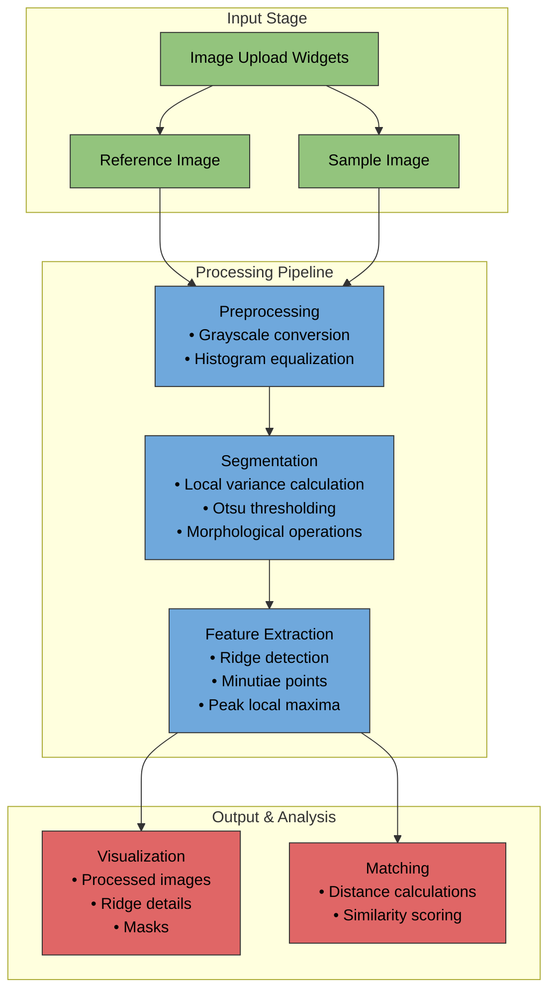

# FprintMatch---A-Fingerprint-Matching-Software

This is a comprehensive implementation of a fingerprint matching system built as an interactive Jupyter notebook application. 
### System Architecture

The system follows a modular design pattern with distinct stages for image processing, feature extraction, and matching. Here's the high-level architecture:



The diagram above illustrates the system's workflow, where:

- Green components represent input handling
- Blue components show the core processing pipeline
- Red components indicate output generation and analysis

Each arrow represents data flow between components, with the processing pipeline feeding both visualization and matching stages.

### Core Components

#### 1. Class Structure

The `FingerprintMatcher` class manages the entire fingerprint matching process through several key methods:

- `__init__()`: Initializes the matcher and sets up UI components
- `_preprocess_image()`: Handles initial image preparation
- `_segment_fingerprint()`: Isolates fingerprint regions
- `_extract_features()`: Identifies distinctive characteristics
- `_match_features()`: Compares fingerprints

#### 2. Image Processing Pipeline

The preprocessing stage performs several critical operations:

```python
def _preprocess_image(self, image_path):
    # Convert to grayscale if needed
    img = img.convert('L')
    
    # Convert to numpy array
    img_array = np.array(img)
    
    # Apply histogram equalization
    enhanced_img = equalize_hist(img_array)
    
    return enhanced_img
```

This stage ensures images are normalized and ready for feature extraction.

#### 3. Segmentation System

The segmentation process isolates the actual fingerprint pattern:

```python
def _segment_fingerprint(self, processed_image):
    # Calculate local variance
    block_size = 25
    local_variance = rank.variance(processed_image, morphology.square(block_size))
    
    # Threshold the variance image
    threshold_value = filters.threshold_otsu(local_variance)
    mask = local_variance > threshold_value
    
    # Refine mask
    mask = morphology.binary_closing(mask, morphology.square(5))
    mask = morphology.binary_fill_holes(mask)
    
    return mask.astype(np.uint8)
```

#### 4. Feature Extraction

Features are extracted using ridge detection and minutiae points:

```python
def _extract_features(self, processed_image, mask):
    # Ridge detection using Sobel filters
    sobel_x = filters.sobel_h(processed_image)
    sobel_y = filters.sobel_v(processed_image)
    
    # Combine gradients
    gradient = np.sqrt(sobel_x**2 + sobel_y**2)
    
    # Apply mask to gradient image
    masked_gradient = gradient * mask
    
    # Find local maxima for minutiae points
    coordinates = peak_local_max(masked_gradient, min_distance=10)
    
    return coordinates, gradient, mask
```

#### 5. Matching Algorithm

The matching system calculates similarity scores between fingerprints:

```python
def _match_features(self, ref_points, samp_points):
    # Calculate distances between all point pairs
    distances = []
    for ref_point in ref_points:
        for samp_point in samp_points:
            dist = euclidean(ref_point, samp_point)
            distances.append(dist)
    
    # Calculate similarity score
    threshold = 10
    matches = sum(d < threshold for d in distances)
    similarity_score = (matches / max_possible_matches) * 100
    
    return similarity_score
```

### Usage Instructions

Upload reference and sample fingerprint images using the file upload widgetsClick "Process Images" to begin analysisReview the processed images, ridge details, and masksClick "Match Fingerprints" to compare and generate similarity score### Visualization Features

The system provides comprehensive visualization at multiple stages:

- Processed images with enhanced contrast
- Ridge detail maps showing fingerprint patterns
- Segmentation masks highlighting valid regions
- Minutiae points marked on both masked and unmasked views
- Similarity scores indicating match confidence

This implementation combines robust image processing techniques with interactive visualization tools, making it suitable for educational purposes and practical applications. The modular design allows for easy modification and extension of individual components as needed.
